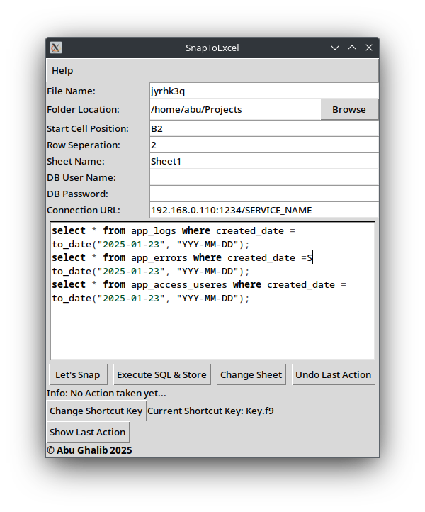
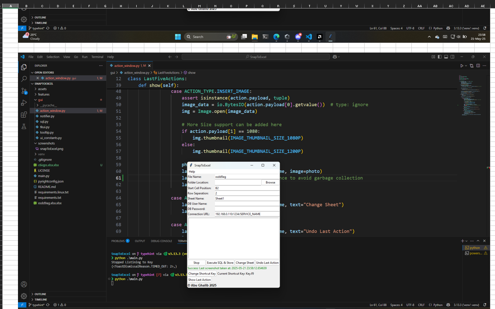

# SnapToExcel

A Python based tool to automatically create excel sheets from Screenshot and executing SQL queries.

Works on Windows and Linux OS, Not tested on Mac OS.

## Screenshots

<details>
    <summary>Show</summary>




</details>

## Use Cases

- Taking lots of Screenshot for a project validation with client.
- Adding expected value from database to excel sheet.

## Requirements

- Install [Python 3.8+](https://www.python.org/)
- virtualenv [Virtual Environment](https://virtualenv.pypa.io/en/latest/)

### On Linux

### Install Dev Dependencies (Debian Based)

 ```bash
 sudo apt install python3-dev python3-pip build-essential libgtk-3-dev python3-tk
 ```

### On Windows

#### Install Build Tools

- Using Visual Studio
    [Microsoft Visual Studio Build Tools using Visual Studio](https://visualstudio.microsoft.com/downloads/)

- Using Winget CLI

    ```powershell
    winget install Microsoft.VisualStudio.2022.BuildTools --force --override "--wait --passive --add Microsoft.VisualStudio.Component.VC.Tools.x86.x64 --add Microsoft.VisualStudio.Component.Windows11SDK.22621"
    ```

### Setup Development Environment

1. Create & Activate virtual environment

    ```bash
    python3 -m virtualenv venv
    ```

2. Activate the virtual environment

    On Linux:

    ```bash
    source venv/bin/activate
    ```

    On Windows (Powershell 5+):

    ```bash
    ./venv/Scripts/activate
    ```

3. Install dependencies

    On Windows

    ```bash
    pip install -r requirements.txt
    ```

    On Linux

    ```bash
    pip install -r requirements.txt
    ```

    ```bash
    pip install -r requirements.linux.txt
    ```

## Build Executable

- [Setup Development Environment](#setup-development-environment)

### Build Executable exe on Windows

- Run the application

    ```bash
    python main.py
    ```

- Build Exe using Cx_Freeze

    ```bash
    python cxfreeze_config.py build
    ```

### Build Executable on Linux

- Run the application

    ```bash
    python main.py
    ```

- Build using Cx_Freeze

    ```bash
    python cxfreeze_config.py build
    ```

## Contributing

- Pull requests are welcome. For major changes, please open an issue first to discuss what you would like to change.

## License

[MIT](LICENSE)
